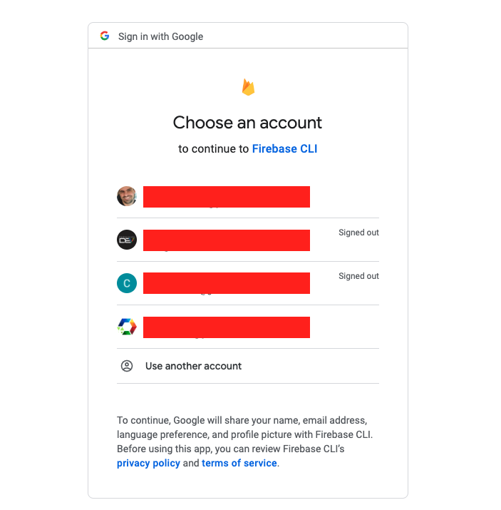

<p align="center">
  
</p>

# Configuração do Projeto

### 1. Clonar o repositório
- Clonar o repositório
```
git clone https://github.com/arquitetodev/poupig
```

- Instalar as dependências via terminal (dentro da pasta principal)
```
npm i
```

### 2. Criar projeto no firebase

[Console Firebase](https://console.firebase.google.com/u/0/)

### 3 Criar uma Aplicação Web

- Entrar em Projeto Overview / Project Settings


- Informe o nome do projeto.


- Copiar informações para o arquivo .env


Dentro do projeto frontend, renomear o arquivo ``.env.sample`` para ``.env.local``
```
NEXT_PUBLIC_FIREBASE_API_KEY=
NEXT_PUBLIC_FIREBASE_AUTH_DOMAIN=
NEXT_PUBLIC_FIREBASE_PROJECT_ID=
```

### 4. Criar banco de dados

- Entrar no menu build e selecionar Firestore Database


- Selecionar o botão ``Create database``


- Selecione a ``Location`` e ``next``


- Vamos manter em ``production mode`` e selecionar o boão ``Enable``


### 5. Configurar banco de dados

- Editar as ``rules`` (regras de acesso) do Firestore


```
rules_version = '2';

service cloud.firestore {
  match /databases/{database}/documents {
    match /{document=**} {
      allow read, write: if false;
    }
    
    match /usuarios/{email} {
    	allow read: if request.auth != null && request.auth.token.email == email;
      allow write: if request.auth != null && request.auth.token.email == email;
    }
    
    match /financas/{email} {
      match /transacoes/{id} {
    		allow read: if request.auth != null && request.auth.token.email == email;
      	allow write: if request.auth != null && request.auth.token.email == email;
    	}
      
      match /recorrencias/{id} {
    		allow read: if request.auth != null && request.auth.token.email == email;
      	allow write: if request.auth != null && request.auth.token.email == email;
    	}
      
      match /sumarios/{id} {
    		allow read: if request.auth != null && request.auth.token.email == email;
      	allow write: if request.auth != null && request.auth.token.email == email;
    	}
    }
    
    match /contas/{email} {      
      match /itens/{id} {
    		allow read: if request.auth != null && request.auth.token.email == email;
      	allow write: if request.auth != null && request.auth.token.email == email;
    	}
    }
    
    match /cartoes/{email} {      
      match /itens/{id} {
    		allow read: if request.auth != null && request.auth.token.email == email;
      	allow write: if request.auth != null && request.auth.token.email == email;
        
        match /faturas/{id} {
    			allow read: if request.auth != null && request.auth.token.email == email;
      		allow write: if request.auth != null && request.auth.token.email == email;
    		}
    	}
    }
    
    match /categorias/{email} {
      match /itens/{id} {
    		allow read: if request.auth != null && request.auth.token.email == email;
      	allow write: if request.auth != null && request.auth.token.email == email;
    	}
    }
    
    match /eventos/{id} {      
    	allow read: if request.auth != null;
      allow write: if request.auth != null;
    }
    
    match /extratos/{email} {      
      match /mensais/{id} {
    		allow read: if request.auth != null && request.auth.token.email == email;
      	allow write: if request.auth != null && request.auth.token.email == email;
        
        match /transacoes/{id} {
    			allow read: if request.auth != null && request.auth.token.email == email;
      		allow write: if request.auth != null && request.auth.token.email == email;
    		}
    	}
      
      match /recorrencias/{id} {
    		allow read: if request.auth != null && request.auth.token.email == email;
      	allow write: if request.auth != null && request.auth.token.email == email;
    	}
    }
  }
}
```

### 6. Configurar autenticação

- Configurar autenticação com ``Google``


- (Opcional) Depois pode repetir os processos para ``Facebook`` e ``Yahoo``


### 7. Configurar cloud function

- Entrar no Menu ``Build`` > ``Functions``

- Vai precisar habilitar a parte de faturamento, mas **NÃO** será cobrado nada de início. A cobrança é pelo uso e tem uma boa camada gratuita.


- Eu usei uma conta já configurada, mas se não tiver vai precisar criar uma nova conta de faturamento


- Colocar um valor para ser notificado quando chegar nesse valor, mas isso só vai ocorrer de a aplicação tiver muito uso


- Finalizar a conversão para o plano ``Blazer``


- Agora é clicar em ``Get started``


- Continue


- Finalizar


### 8. Configurar Firebase CLI

- Instalar via terminal o CLI do firebase
```
npm i -g firebase-tools
```

- Executar o login via CLI do firebase
```
firebase login
```

- Depois de executar o login é solicitado via browser para selecionar a conta



- Permitir o CLI ter acesso a sua conta no firebase


- Mensagem de sucesso


- Executar o comando no terminal para listar os projetos

```
firebase projects:list
```

- No terminal entre na pasta ``apps/backend``
```
# dentro da pasta do projeto
cd apps/backend
```

- Selecione o projeto usando o seu número

```
firebase use <numero-do-projeto>
```

### 9. Configurar PUB/SUB

[Entrar Console do Google Cloud](https://console.cloud.google.com/cloudpubsub/topic/list)

- Selecione o projeto correto e vamos criar um ``topic``


- Criar um ``topic`` com nome de ``extrato-alterado``


### 10. Deploy do Backend

- Dentro da pasta do projeto ``backend`` executar o seguinte comando no terminal

```
npm run deploy
```

### 11. Executar Frontend
- Dentro da pasta principal do projeto

```
npm run dev
```